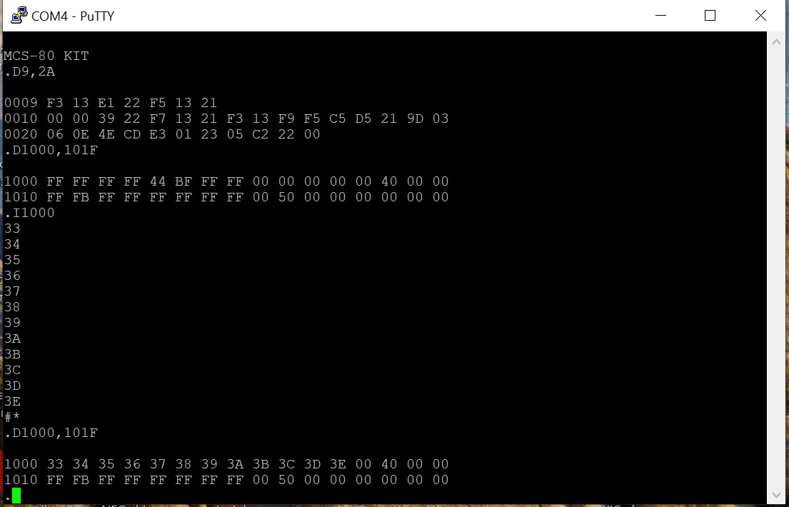

# MSC-80 mini 8080A single board computer
This is a modified version of old Intel MSC-80 SDK, which utilize the Intel 8080A 8-bit processor. In this modification I tried to reduce size of pcb and number of ICs to minimum.
I have a bunch of old soviet era 8080 CPU clones, which are relatively chip now.
In current revision 74LS93 divider was replaces by 74LS92 divider, with is naturally /12, /6 or /3 divider. The board on picture below shows previous version with /16 divider (КР1553ИЕ5), configurated as /6.

The board has 2KB of UV EEPROM, 2KB of SRAM and 8251 UART controller for communication with console. In this version I used a 16,588MHz crystal to get the 1,8432MHz clock output, which could be divided by 6 or by 12 ro get correct baudrates.
Adress decoding also simplified comparing to original design and done by 3NAND gates. The address map are follow:
*ROM: 0000H-07FFH
*RAM: 1000H-17FFH
*UART: 0FAH
This version of board does not provide address buffering, but it is enough to work with onboard chips.
Communication with terminal program on the host computer is done via com port. Depending of the software and divide ratio it could be up to 19200 kb/s, RTS/CTS handshake, 8n1.
Since the processor use three voltages to operate, the board has build-in -5V charge pump circuit, but still required +5V and +12V. I used simple step-up converter to get +12V from +5V, but it was mounted outside the board. Power consumption from +5V is about 600 mA.
#Software
I've tried this board with original firmware, but since it was very old and intended to work with teletype, original monitor have very limited set of commands.

I found nice solution with GW monitor, with small modifications of addresses in source code it is also work and feet in existing ROM.
There also simple test program to test the 8251 communication functions.
Also I want to try 1K BASIC on this board.
